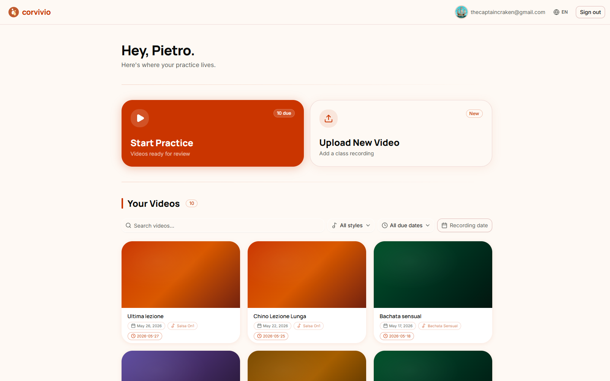
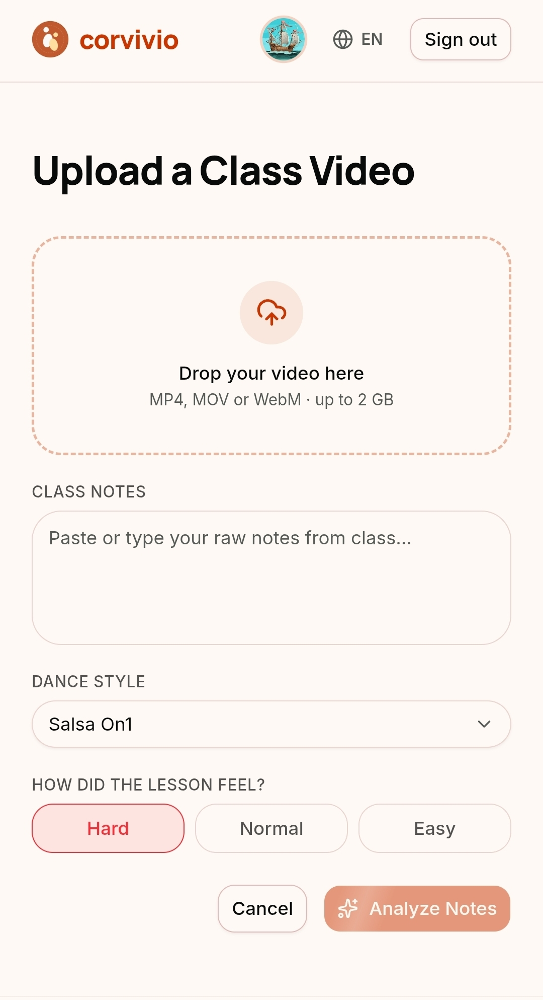
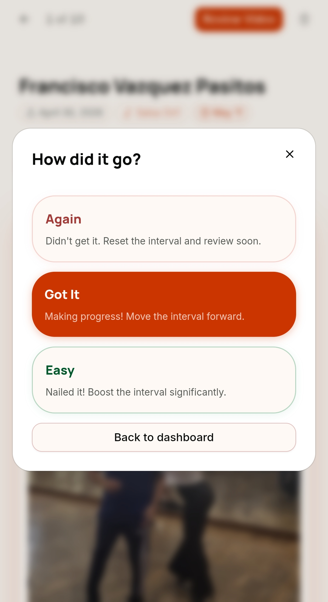


My phone had 47 dance class videos. I had watched exactly zero of them.


I've been doing salsa and bachata for a while now. Same ritual every class: instructor shows something cool, I record it, I tell myself I'll review it later. Later never comes. The videos pile up until my phone runs out of storage.

For a long time the fix was simple: connect the phone to the PC, drag the videos to a folder, done. Problem solved. Phone storage: back to normal.

Except it wasn't really solved. It was just... relocated.

## The Folder That Ate My Progress

The folder grew into a graveyard of files like `SalsaOn1/12-02-2026_no_music.mp4`. No idea what was in any of them, and no system for *when* to review. So I just drilled the latest clips and let everything older fall away.

Two years of dancing, most of it forgotten, even though I **had the videos**. Every lost move sitting right there in that folder. Unacceptable.

The videos were off my phone, sure. But the learning was still going nowhere.

## So I Built Something

Corvivio is a web app for dance students. You upload a video from your camera roll, write a quick note about what you learned (doesn't have to be fancy, just whatever you'd write in a notebook), and that's it. From there:

- **Claude AI** reads your notes and turns them into a short list of structured practice tips.
- **SM-2 scheduling** gives each video its own spaced repetition card, so the app tells you when you should watch it again based on how well you remembered it last time.

The idea is simple: you do the class, you record it, you dump your notes, and then you let the app do the work of figuring out when to bring it back to your attention. No more guessing. No more folders full of mystery files.

## Two Features. That's It.

I wanted to run this like the leanest startup possible. So the first version was an MVP, a prototype, with exactly two things working:

1. **Upload a video**: add a title, write your notes, get your tips
2. **Practice queue**: a daily list of videos the SM-2 algorithm thinks you should review, with a simple rating at the end (again / got it / easy)

No clip tagging, no position graphs, no social features, no mobile app.

Those are all genuinely interesting ideas that I'd already mapped out in a roadmap. But right then they were distractions.

The only question worth answering first was: does reviewing dance videos on a schedule actually help you retain the material? If the answer was yes, everything else follows. If the answer was no, I'd rather find out before I'd built a position graph.

## What the Prototype Actually Taught Me

First, the big question: does spaced repetition actually help you dance better? **Yes. Absolutely.** It helps a *lot*.

Practicing (almost) every weekend with my friend Caterina, I could see it: I remembered the lessons more vividly, and having a curated selection of *which* ones to review in our limited time was fantastic. The retention works. The method is sound.

So the core idea is validated. The problem is everything around it.

I thought the problem was *extracting* the videos. Turns out everyone's already good at that. What almost nobody does is upload it, and almost nobody who uploads it actually practices it. The video gets taken and then it dies, same as it did in the camera roll.

Lesson learned: the problem isn't only making it *easy*. It's *reminding* people to practice. Easy gets you the upload. Reminders get you the reps.

A couple of other things surfaced too:

- **Streaming is too slow.** The MVP runs on R2 buckets, and even with streaming the videos can be painfully slow to download on poor connections. The real issue is the format: raw MP4 just isn't optimized for this. That has to change.
- **Reels are a whole untapped pile.** A lot of people save Instagram reels with moves they want to learn, then never open them again. Same disease, different folder. Corvivio needs a way to ingest those too.

The honest result: the first version sparked interest but it didn't get adopted. Users dropped out.

## For the Nerds: How the MVP Was Built

If you don't care about the stack, skip ahead. If you do, pull up a chair.

The whole thing took about a week, built mostly by leaning on **Claude Code**. I genuinely enjoyed the process, especially using it to sketch a super quick UI that, honestly, turned out decent. Way better than I expected for something thrown together that fast.

It's a pretty standard web app under the hood:

- **Frontend**: React with [React Router](https://reactrouter.com/).
- **Backend**: [Bun](https://bun.sh/) running [Elysia](https://elysiajs.com/) (a super cool framework, in my opinion).
- **Database**: PostgreSQL managed using the drizzle ORM on the backend.
- **Video storage**: [Cloudflare R2](https://www.cloudflare.com/developer-platform/products/r2/). It's S3-compatible object storage, but the killer feature is **zero egress fees**. And I mean zero. I can download the videos as many times as I want with no additional charges, which matters a lot when your whole product is shipping video around.
- **AI**: the Claude API, using Sonnet 4.6, to turn messy class notes into structured practice tips.
- **Auth**: [Clerk](https://clerk.com/). Setting up Google sign-in with it was a breeze.
- **Deploy**: everything went out on [Railway](https://railway.com/).
- **Task tracking**: [Linear](https://linear.app/), which is just fantastic. Can't stress that enough.

### Video Delivery is a Scary Problem

Seriously, guys. It's a mess. This is the part nobody warns you about.

Even the first version wasn't simple. To upload, the client asks my backend for a **signed URL**, then uploads *directly* to R2 with it. Why the detour? I don't want video bytes traveling through my backend, it would tie it up *and* cost me network traffic, and I'm just a poor student. Downloads work the same way in reverse.

That worked, but it was too slow. So I went down the rabbit hole.

For uploads, I moved to **multipart upload**. The idea is simple: instead of pushing the whole file over a single TCP connection, you chunk it and upload each chunk separately, then tell R2 to stitch them back together at the end. Faster, yes. Enough? No. On bad connections it still struggled, and I never implemented retry logic, so if a single chunk failed, the *entire* upload failed. Brutal.

But in the end, uploads could have been solved with enough effort. The real problem is **delivery**. Streaming MP4 straight off R2 is not fast. At all. MP4 just isn't built for streaming, and the videos were never compressed, so every play pulled the full, highest-quality file, which is brutal for someone on a phone with two bars of signal.

Version 2 has to fix this properly: change the format into something stream-friendly, and put a decent CDN with some caching in front of it.

And before you ask: "WHY DON'T YOU JUST USE CLOUDFLARE STREAM FOR IT? CMON!" Because Cloudflare Stream is **$5 for every 1,000 (one) minutes of video stored**, every month. For a video product on a student budget, that's way outside what I can spend. So, no.

It wasn't all smooth elsewhere, either.

The Clerk invitation feature did *not* work, as my friend Andrea can testify. Poor guy, I tried to invite him three times and not a single one went through.

I'm generally happy with this stack. But version 2 is going to look different, and that's a story for the next article, where I'll walk through the full project *before* building it.

## One Minute a Day

Then there was the thing that actually reframed the project for me. Francisco Vazquez, brother of Johnny Vazquez (the main teacher and owner of my dance school), said:


You need just one minute. Every day. Just one minute.


That's the unit. Not a study session, not a review queue you have to carve out time for. One minute a day.

So I'm building version 2 around that idea, and I'm going to ship it. Its only goal is to be extremely easy to use and extremely easy to *keep* using. If it gets adopted, great. If it doesn't, then there's no hope for this idea and at least I'll know.

This series is my attempt to build in public. I'll be writing about what I'm building, what breaks, what surprises me, and eventually whether anyone besides me actually uses this thing.

Let's see if it sticks.
